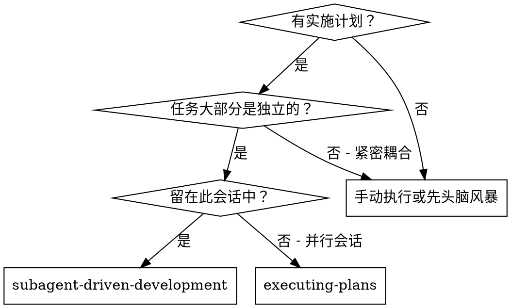
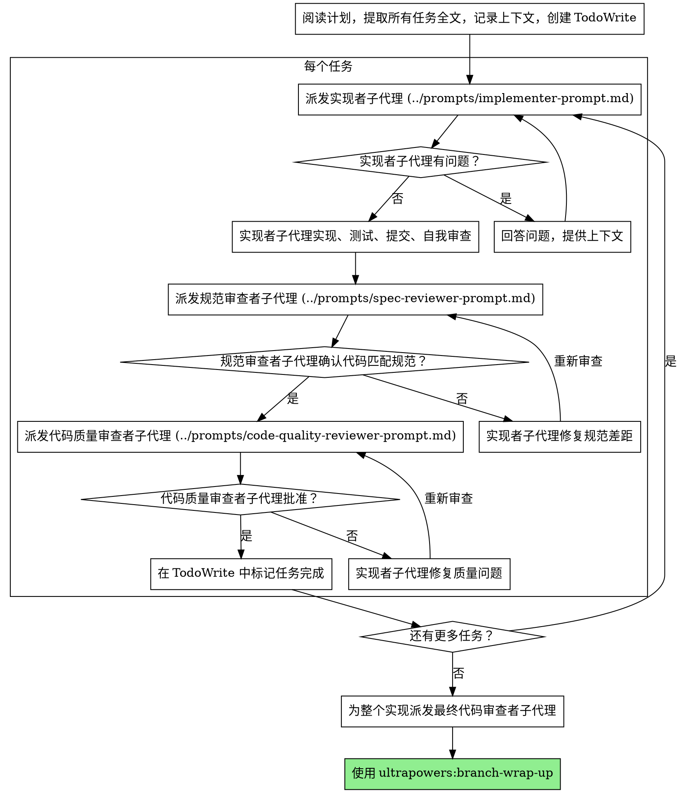

# 子代理驱动开发

通过为每个任务派发新的子代理来执行计划，每个任务后进行两阶段审查：首先是规范符合性审查，然后是代码质量审查。

**为什么用子代理：** 你将任务委派给具有隔离上下文的专业代理。通过精确构建它们的指令和上下文，你确保它们保持专注并成功完成任务。它们不应继承你会话的上下文或历史记录 — 你构建它们恰好需要的内容。这还为你保留了协调工作的上下文。

**核心原则：** 每个任务新子代理 + 两阶段审查（规范然后质量）= 高质量，快速迭代

**持续执行：** 不要在任务之间停下来与你的合作伙伴签到。不间断地执行计划中的所有任务。停止的唯一原因是：你无法解决的 BLOCKED 状态、真正阻止进展的歧义，或所有任务完成。"我应该继续吗？"提示和进度摘要浪费他们的时间 — 他们要求你执行计划，所以执行它。

## 何时使用



**vs. 执行计划（并行会话）：**
- 相同会话（无上下文切换）
- 每个任务新子代理（无上下文污染）
- 每个任务后两阶段审查：先规范符合性，然后代码质量
- 更快迭代（任务之间无需人工介入）

## 流程



## 子代理的上下文检索

派发子代理时，它们通常不知道需要哪些上下文。使用迭代检索来解决此问题：

**问题：** 子代理生成时上下文有限。它们不知道哪些文件包含相关代码、存在什么模式、项目使用什么术语。

**解决方案：4 阶段迭代循环（最多 3 个周期）：**

1. **调度** — 从基于任务的广泛搜索模式和关键词开始
2. **评估** — 对检索到的文件进行相关性评分（高 0.8-1.0，中 0.5-0.7，低 0.2-0.4，无 0-0.2）
3. **优化** — 基于差距更新搜索：从高相关性文件中添加模式，添加发现的术语，排除确认不相关的路径
4. **循环** — 用优化后的查询重复，直到上下文足够或 3 个周期

**评分标准：**
- **高 (0.8-1.0)：** 直接实现目标功能
- **中 (0.5-0.7)：** 包含相关模式或类型
- **低 (0.2-0.4)：** 略微相关
- **无 (0-0.2)：** 排除

**最佳实践：**
- 从宽泛开始，逐步细化 — 不要过度指定初始查询
- 从第一轮学习代码库术语
- 追踪仍缺失的内容以驱动优化
- 在"足够好"时停止 — 3 个高相关性文件胜过 10 个中等相关性文件
- 自信地排除低相关性文件

## 模型选择

使用能够处理每个角色的最不强大的模型以节省成本并提高速度。

**机械实现任务**（隔离函数、清晰规范、1-2 个文件）：使用快速、便宜的模型。当计划规范良好时，大多数实现任务是机械的。

**集成和判断任务**（多文件协调、模式匹配、调试）：使用标准模型。

**架构、设计和审查任务：** 使用最强大的可用模型。

**任务复杂度信号：**
- 触及 1-2 个文件且有完整规范 → 便宜模型
- 触及多个文件涉及集成问题 → 标准模型
- 需要设计判断或广泛的代码库理解 → 最强大的模型

## 处理实现者状态

实现者子代理报告四种状态之一。适当地处理每个：

**DONE：** 继续进行规范符合性审查。

**DONE_WITH_CONCERNS：** 实现者完成了工作但标记了疑虑。在继续之前阅读关注点。如果关注点是关于正确性或范围，在审查之前解决它们。如果它们是观察（例如"这个文件正在变大"），记录它们并继续审查。

**NEEDS_CONTEXT：** 实现者需要未提供的信息。提供缺失的上下文并重新派发。

**BLOCKED：** 实现者无法完成任务。评估阻塞：
1. 如果是上下文问题，提供更多上下文并用相同模型重新派发
2. 如果任务需要更多推理，用更强大的模型重新派发
3. 如果任务太大，拆分为更小的部分
4. 如果计划本身有错误，上报给人类

**永远**不要忽略升级或用相同模型重试而不做更改。如果实现者说卡住了，需要改变什么。

## 提示模板

- `../prompts/implementer-prompt.md` — 派发实现者子代理
- `../prompts/spec-reviewer-prompt.md` — 派发规范符合性审查者子代理
- `../prompts/code-quality-reviewer-prompt.md` — 派发代码质量审查者子代理

## 示例工作流

```
你：我正在使用子代理驱动开发来执行此计划。

[一次性阅读计划文件：docs/ultrapowers/plans/feature-plan.md]
[提取所有 5 个任务及全文和上下文]
[用所有任务创建 TodoWrite]

任务 1：钩子安装脚本

[获取任务 1 文本和上下文（已提取）]
[用完整任务文本 + 上下文派发实现子代理]

实现者："开始之前 — 钩子应该安装在用户级还是系统级？"

你："用户级（~/.config/ultrapowers/hooks/）"

实现者："明白了。现在实施..."
[稍后] 实现者：
  - 实施了 install-hook 命令
  - 添加了测试，5/5 通过
  - 自我审查：发现我遗漏了 --flag，添加了它
  - 已提交

[派发规范符合性审查者]
规范审查者：✅ 规范符合 — 所有需求满足，没有多余

[获取 git SHA，派发代码质量审查者]
代码审查者：优点：良好的测试覆盖率，干净。问题：无。已批准。

[标记任务 1 完成]

任务 2：恢复模式

[获取任务 2 文本和上下文（已提取）]
[用完整任务文本 + 上下文派发实现子代理]

实现者：[没有问题，直接进行]
实现者：
  - 添加了验证/修复模式
  - 8/8 测试通过
  - 自我审查：一切正常
  - 已提交

[派发规范符合性审查者]
规范审查者：❌ 问题：
  - 缺少：进度报告（规范说"每 100 项报告"）
  - 多余：添加了 --json 标志（未请求）

[实现者修复问题]
实现者：删除了 --json 标志，添加了进度报告

[规范审查者再次审查]
规范审查者：✅ 现在规范符合

[派发代码质量审查者]
代码审查者：优点：扎实。问题（重要）：魔法数字（100）

[实现者修复]
实现者：提取了 PROGRESS_INTERVAL 常量

[代码审查者再次审查]
代码审查者：✅ 已批准

[标记任务 2 完成]

...

[所有任务之后]
[派发最终代码审查者]
最终审查者：所有需求满足，准备合并

完成！
```

## 优势

**vs. 手动执行：**
- 子代理自然地遵循 TDD
- 每个任务新上下文（无混淆）
- 并行安全（子代理不互相干扰）
- 子代理可以提问（之前和工作中都可以）

**vs. 执行计划：**
- 相同会话（无交接）
- 持续进度（无需等待）
- 自动审查检查点

**效率提升：**
- 无文件读取开销（控制器提供全文）
- 控制器精确策展所需的上下文
- 子代理预先获得完整信息
- 问题在工作开始之前浮现（不是之后）

**质量关卡：**
- 自我审查在交接前捕获问题
- 两阶段审查：规范符合性，然后代码质量
- 审查循环确保修复实际有效
- 规范符合性防止过度/不足构建
- 代码质量确保实现构建良好

**成本：**
- 更多子代理调用（每个任务实现者 + 2 个审查者）
- 控制器做更多准备工作（预先提取所有任务）
- 审查循环增加迭代
- 但早期捕获问题（比之后调试更便宜）

## 注意标志

**绝不：**
- 未经用户明确同意在 main/master 分支上开始实现
- 跳过审查（规范符合性**或**代码质量）
- 有问题未修复就继续
- 并行派发多个实现子代理（冲突）
- 让子代理读取计划文件（提供全文）
- 跳过场景设置上下文（子代理需要了解任务适合的位置）
- 忽略子代理问题（在让它们继续之前回答）
- 接受规范符合性的"差不多"（审查者发现问题 = 未完成）
- 跳过审查循环（审查者发现问题 = 实现者修复 = 再次审查）
- 让实现者自我审查替代实际审查（两者都需要）
- **在规范符合性为 ✅ 之前开始代码质量审查**（顺序错误）
- 在任一审查有问题未修复时移动到下一个任务

**如果子代理提问：**
- 清楚完整地回答
- 如果需要提供更多上下文
- 不要催促它们进入实现

**如果审查者发现问题：**
- 实现者（相同子代理）修复它们
- 审查者再次审查
- 重复直到批准
- 不要跳过重新审查

**如果子代理任务失败：**
- 用特定指令派发修复子代理
- 不要手动修复（上下文污染）

## 集成

**必需的工作流技能：**
- **ultrapowers:branch-isolation** — 确保隔离工作区（创建或验证现有的）
- **ultrapowers:task-decomposition** — 创建此技能执行的计划
- **ultrapowers:code-review-request** — 审查者子代理的代码审查模板
- **ultrapowers:branch-wrap-up** — 所有任务完成后完成开发

**子代理应该使用：**
- **ultrapowers:red-green-cycle** — 子代理遵循 TDD 进行每个任务

**替代工作流：**
- **ultrapowers:plan-execution** — 用于并行会话而非同会话执行
