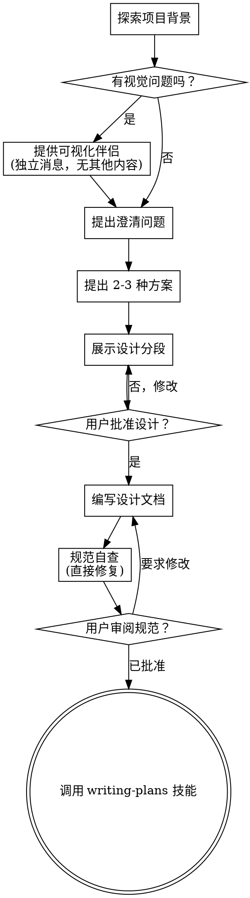

# 头脑风暴：从想法到设计

通过自然协作对话帮助将想法转化为完整的设计和规范。

首先了解当前项目背景，然后一次一个问题来完善想法。一旦你理解了要构建什么，展示设计并获得用户批准。

<HARD-GATE>
在展示设计并获得用户批准之前，不得调用任何实现技能、编写任何代码、搭建任何项目或采取任何实现措施。这适用于每个项目，无论看起来多么简单。
</HARD-GATE>

## 反模式："这太简单了不需要设计"

每个项目都要经过这个过程。待办列表、单功能工具、配置更改 — 全部如此。"简单"的项目是未经验证的假设造成最多浪费的地方。设计可以很短（对于真正简单的项目几句话即可），但你必须展示并获得批准。

## 清单

你必须为以下每个项目创建任务并按顺序完成：

1. **探索项目背景** — 检查文件、文档、最近的提交
2. **提供可视化伴侣**（如果主题涉及视觉问题）— 这是独立的消息，不与澄清问题合并。请参阅下面的"可视化伴侣"部分。
3. **提出澄清问题** — 一次一个问题，了解目的/约束/成功标准
4. **提出 2-3 种方案** — 附带权衡和你的推荐
5. **展示设计** — 按复杂度分段，每段后获取用户批准
6. **编写设计文档** — 保存到 `docs/ultrapowers/specs/YYYY-MM-DD-<topic>-design.md` 并提交
7. **规范自查** — 快速检查占位符、矛盾、歧义、范围（见下文）
8. **用户审阅书面规范** — 在继续之前要求用户审阅规范文件
9. **过渡到实现** — 调用 writing-plans 技能创建实现计划

## 流程

**终止状态是调用 writing-plans。** 不要调用 frontend-design、mcp-builder 或任何其他实现技能。头脑风暴后唯一调用的技能是 writing-plans。

## 流程详解

**理解想法：**

- 首先查看当前项目状态（文件、文档、最近的提交）
- 在提出详细问题之前，评估范围：如果请求描述了多个独立的子系统（例如"构建一个包含聊天、文件存储、计费和分析的平台"），立即标记。不要在需要分解的项目上花时间细化细节。
- 如果项目太大不适合单个规范，帮助用户分解为子项目：独立的部分是什么，它们如何关联，应该按什么顺序构建？然后通过正常设计流程头脑风暴第一个子项目。每个子项目有自己的规范 → 计划 → 实现周期。
- 对于范围适当的项目，一次一个问题来完善想法
- 尽可能使用多选题，但开放式也可以
- 每条消息只问一个问题 — 如果某个主题需要更多探索，拆分为多个问题
- 专注于理解：目的、约束、成功标准

**探索方案：**

- 提出 2-3 种不同方案及权衡
- 以对话方式展示选项，附带你的推荐和理由
- 首先展示你推荐的选项并解释原因

**先搜索再构建：**

在提出任何实施方案之前，运行 **search-first** 检查：
1. 这是否已存在于仓库中？→ `rg` 搜索相关模块/测试
2. 这是常见问题吗？→ 搜索 npm/PyPI 中的现有包
3. 有对应的 MCP 吗？→ 检查 `~/.claude/settings.json`
4. 有对应的技能吗？→ 检查 `~/.claude/skills/`
5. GitHub 上有参考实现吗？→ 在从头编写之前搜索

**决策矩阵：**

| 信号 | 行动 |
|------|------|
| 完全匹配，维护良好，MIT/Apache 许可证 | **采纳** — 直接安装并使用 |
| 部分匹配，基础良好 | **扩展** — 安装 + 编写薄封装层 |
| 多个弱匹配 | **组合** — 组合 2-3 个小包 |
| 未找到合适的 | **构建** — 编写自定义代码，但需基于研究 |

这能避免重复造轮子，减少自定义代码维护负担。

**展示设计：**

- 一旦你理解了要构建什么，展示设计
- 按复杂度调整每段的长度：简单的话几句话，复杂的话 200-300 字
- 每段后询问是否看起来正确
- 涵盖：架构、组件、数据流、错误处理、测试
- 如果某些内容没有意义，准备回去澄清

**隔离性和清晰性设计：**

- 将系统分解为更小的单元，每个单元都有明确的目的、通过定义良好的接口通信、可以独立理解和测试
- 对于每个单元，你应该能回答：做什么、如何使用、依赖什么？
- 有人能在不阅读内部实现的情况下理解单元的功能吗？你能在不破坏使用者的情况下更改内部实现吗？如果不能，边界需要改进。
- 更小、边界清晰的单元也更容易你处理 — 你能更好地推理一次能掌握的代码，当文件专注时你的编辑更可靠。当文件变大时，这通常是一个信号说明它做得太多了。

**在现有代码库中工作：**

- 在提出变更之前探索当前结构。遵循现有模式。
- 当现有代码存在问题影响工作时（例如文件变得太大、边界不清、职责混乱），将针对性改进作为设计的一部分 — 就像优秀的开发人员改进他们正在处理的代码一样。
- 不要提出无关的重构。专注于服务于当前目标的内容。

## 设计之后

**文档：**

- 将验证过的设计（规范）写入 `docs/ultrapowers/specs/YYYY-MM-DD-<topic>-design.md`
  -（用户对规范位置的偏好覆盖此默认值）
- 如果可用，使用 elements-of-style:writing-clearly-and-concisely 技能
- 将设计文档提交到 git

**规范自查：**
写完规范文档后，以全新的眼光审视：

1. **占位符扫描：** 有"TBD"、"TODO"、不完整部分或模糊要求吗？修复它们。
2. **内部一致性：** 各部分之间有矛盾吗？架构与功能描述匹配吗？
3. **范围检查：** 这对单个实现计划来说足够专注了，还是需要分解？
4. **歧义检查：** 任何要求是否可以有两种不同解释？如果是，选择一种并明确说明。

直接修复任何问题。不需要重新审阅 — 直接修复并继续。

**用户审阅关卡：**
在规范审阅循环通过后，要求用户在继续之前审阅书面规范：

> "规范已写入并提交到 `<path>`。请审阅并告诉我们是否需要在开始编写实现计划之前进行任何更改。"

等待用户的回复。如果他们要求修改，进行修改并重新运行规范审阅循环。只有在用户批准后才继续。

**实现：**

- 调用 writing-plans 技能创建详细的实现计划
- 不要调用其他技能。writing-plans 是下一步。

## 核心原则

- **一次一个问题** — 不要用多个问题压倒用户
- **优先多选** — 尽可能比开放式更容易回答
- **无情 YAGNI** — 从所有设计中删除不必要的功能
- **探索替代方案** — 在确定之前始终提出 2-3 种方案
- **增量验证** — 展示设计，获得批准后再继续
- **保持灵活** — 当某些内容没有意义时回去澄清

## 可视化伴侣

一个基于浏览器的伴侣，用于在头脑风暴期间展示模型、图表和视觉选项。作为工具可用 — 不是模式。接受伴侣意味着它可用于受益于视觉处理的问题；这并不意味着每个问题都通过浏览器。

**提供伴侣：** 当你预计接下来的问题将涉及视觉内容（模型、布局、图表）时，提供一次获取同意：
> "我们正在处理的一些内容如果我在网页浏览器中展示可能会更容易解释。我可以随时整理模型、图表、比较和其他视觉效果。这个功能仍然较新且可能消耗较多 token。想试试吗？（需要打开本地 URL）"

**此提议必须是独立的消息。** 不要将其与澄清问题、上下文摘要或任何其他内容合并。消息应仅包含上述提议，不包含其他内容。在继续之前等待用户的回复。如果他们拒绝，继续仅使用文本的头脑风暴。

**每个问题的决定：** 即使接受后，也要为每个问题决定是使用浏览器还是终端。测试：**用户通过看比通过读能更好地理解吗？**

- **使用浏览器** 用于视觉内容 — 模型、线框图、布局比较、架构图、并排视觉设计
- **使用终端** 用于文本内容 — 需求问题、概念选择、权衡列表、A/B/C/D 文本选项、范围决策

关于 UI 主题的问题不自动是视觉问题。"这在这个上下文中意味着什么？"是概念性问题 — 使用终端。"哪个向导布局更好？"是视觉性问题 — 使用浏览器。

如果他们同意伴侣，在继续之前阅读详细指南：
`../docs/visual-companion.md`
