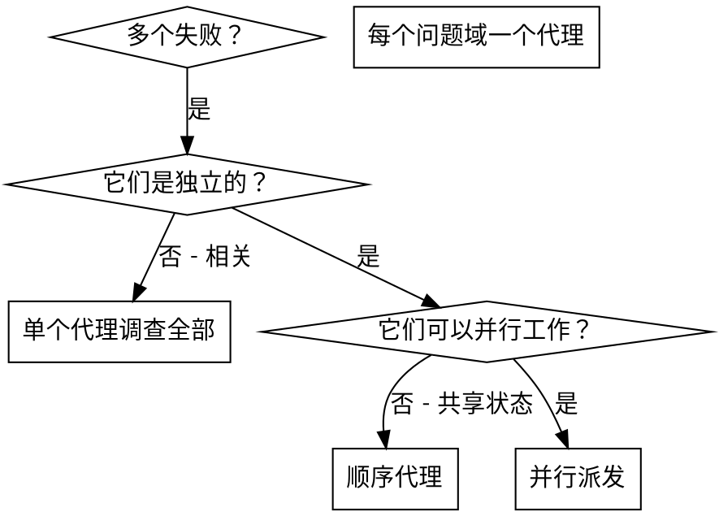

# 并行派发代理

## 概述

你将任务委派给具有隔离上下文的专业代理。通过精确构建它们的指令和上下文，你确保它们保持专注并成功完成任务。它们不应继承你会话的上下文或历史记录 — 你构建它们恰好需要的内容。这还为你保留了协调工作的上下文。

当你遇到多个无关的失败（不同的测试文件、不同的子系统、不同的 bug）时，顺序调查会浪费时间。每个调查都是独立的，可以并行进行。

**核心原则：** 每个独立问题域派发一个代理。让它们并发工作。

## 何时使用



**使用场景：**
- 3 个以上测试文件因不同根因而失败
- 多个子系统独立损坏
- 每个问题无需来自其他问题的上下文即可理解
- 调查之间没有共享状态

**不使用场景：**
- 失败是相关的（修复一个可能修复其他）
- 需要了解整个系统状态
- 代理会互相干扰

## 模式

### 1. 识别独立域

按损坏的内容对失败进行分组：
- 文件 A 测试：工具审批流程
- 文件 B 测试：批处理完成行为
- 文件 C 测试：中止功能

每个域都是独立的 — 修复工具审批不会影响中止测试。

### 2. 创建聚焦的代理任务

每个代理获得：
- **特定范围：** 一个测试文件或子系统
- **明确目标：** 使这些测试通过
- **约束：** 不要更改其他代码
- **预期输出：** 你发现并修复的摘要

### 3. 并行派发

```typescript
// 在 Claude Code / AI 环境中
Task("修复 agent-tool-abort.test.ts 失败")
Task("修复 batch-completion-behavior.test.ts 失败")
Task("修复 tool-approval-race-conditions.test.ts 失败")
// 三个并发运行
```

### 4. 审查和集成

当代理返回时：
- 阅读每个摘要
- 验证修复不冲突
- 运行完整测试套件
- 集成所有更改

## 代理提示结构

好的代理提示是：
1. **聚焦的** — 一个明确的问题域
2. **自包含的** — 理解问题所需的所有上下文
3. **关于输出具体明确** — 代理应该返回什么？

```markdown
修复 src/agents/agent-tool-abort.test.ts 中 3 个失败的测试：

1. "should abort tool with partial output capture" — 消息中期望 'interrupted at'
2. "should handle mixed completed and aborted tools" — 快速工具被中止而非完成
3. "should properly track pendingToolCount" — 期望 3 个结果但得到 0

这些是时序/竞态条件问题。你的任务：

1. 阅读测试文件并理解每个测试验证的内容
2. 识别根因 — 时序问题还是实际 bug？
3. 通过以下方式修复：
   - 用基于事件的等待替换任意超时
   - 如果发现中止实现中的 bug 则修复
   - 如果测试行为已更改则调整测试期望

不要只增加超时 — 找到真正的问题。

返回：你发现并修复的摘要。
```

## 常见错误

**❌ 太宽泛：** "修复所有测试" — 代理迷失方向
**✅ 具体：** "修复 agent-tool-abort.test.ts" — 聚焦范围

**❌ 没有上下文：** "修复竞态条件" — 代理不知道在哪里
**✅ 上下文：** 粘贴错误消息和测试名称

**❌ 没有约束：** 代理可能重构所有内容
**✅ 约束：** "不要更改生产代码" 或 "仅修复测试"

**❌ 模糊输出：** "修复它" — 你不知道更改了什么
**✅ 具体：** "返回根因和更改的摘要"

## 去草率化模式

每个实现代理完成后，添加专门的清理步骤：

```
第 1 步：实现（让代理彻底完成）
第 2 步：去草率化（单独的代理，专注清理）
第 3 步：验证（运行构建 + lint + 测试）
第 4 步：提交
```

**原因：** 向实现者添加负面指令（"不要测试类型系统"）会产生下游质量问题 — 模型变得犹豫，跳过合法的边界情况测试。两个专注的代理胜过一个受限的代理。

**去草率化代理提示：**
> "审查工作树中的所有更改。移除：
> - 验证语言/框架行为而非业务逻辑的测试
> - 类型系统已强制执行的冗余类型检查
> - 对不可能状态的过度防御性错误处理
> - console.log 语句
> - 注释掉的代码
>
> 保留所有业务逻辑测试。清理后运行测试套件。"

## 模型路由

使用能处理每个角色的最不强大的模型以节省成本：

- **机械实现**（隔离函数、清晰规范、1-2 个文件）→ 便宜模型
- **集成和判断**（多文件协调、调试）→ 标准模型
- **架构、设计和审查** → 最强大的模型

## 何时不使用

**相关失败：** 修复一个可能修复其他 — 先一起调查
**需要完整上下文：** 理解需要看到整个系统
**探索性调试：** 你还不知道什么坏了
**共享状态：** 代理会互相干扰（编辑相同文件、使用相同资源）

## 会话中的真实示例

**场景：** 重大重构后 3 个文件中有 6 个测试失败

**失败：**
- agent-tool-abort.test.ts：3 个失败（时序问题）
- batch-completion-behavior.test.ts：2 个失败（工具未执行）
- tool-approval-race-conditions.test.ts：1 个失败（执行计数 = 0）

**决策：** 独立域 — 中止逻辑与批处理完成与竞态条件是分开的

**派发：**
```
代理 1 → 修复 agent-tool-abort.test.ts
代理 2 → 修复 batch-completion-behavior.test.ts
代理 3 → 修复 tool-approval-race-conditions.test.ts
```

**结果：**
- 代理 1：用基于事件的等待替换超时
- 代理 2：修复事件结构 bug（threadId 位置错误）
- 代理 3：添加工具执行完成前的等待

**集成：** 所有修复独立，无冲突，完整套件通过

**节省的时间：** 3 个问题并行解决 vs 顺序解决

## 核心优势

1. **并行化** — 多个调查同时发生
2. **专注** — 每个代理范围窄，需要跟踪的上下文少
3. **独立性** — 代理不互相干扰
4. **速度** — 3 个问题在 1 个问题的时间内解决

## 验证

代理返回后：
1. **审查每个摘要** — 了解更改了什么
2. **检查冲突** — 代理是否编辑了相同的代码？
3. **运行完整套件** — 验证所有修复一起工作
4. **抽查** — 代理可能犯系统性错误

## 真实影响

来自调试会话（2025-10-03）：
- 3 个文件中有 6 个失败
- 并行派发 3 个代理
- 所有调查同时完成
- 所有修复成功集成
- 代理更改之间零冲突
