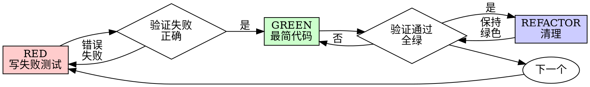

# 测试驱动开发（TDD）

## 概述

先写测试。看它失败。写最简代码让它通过。

**核心原则：** 如果没看到测试失败，你就不确定它测试的是正确的东西。

**违反规则的字面意思就是违反规则的精神。**

## 何时使用

**始终：**
- 新功能
- Bug 修复
- 重构
- 行为更改

**例外（询问你的合作伙伴）：**
- 一次性原型
- 生成的代码
- 配置文件

想"就这一次跳过 TDD"？停止。那是找借口。

## 铁律

```
没有失败的测试，不允许写生产代码
```

在测试之前写代码？删除它。重来。

**没有例外：**
- 不要保留作为"参考"
- 在写测试时不要"适配"它
- 不要看它
- 删除就是删除

从测试开始全新实现。句号。

## 红-绿-重构



### RED — 写失败测试

写一个最小化测试，展示应该发生什么。

<好>
```typescript
test('重试失败操作 3 次', async () => {
  let attempts = 0;
  const operation = () => {
    attempts++;
    if (attempts < 3) throw new Error('fail');
    return 'success';
  };

  const result = await retryOperation(operation);

  expect(result).toBe('success');
  expect(attempts).toBe(3);
});
```
清晰的名字、测试真实行为、一件事
</好>

<坏>
```typescript
test('重试有效', async () => {
  const mock = jest.fn()
    .mockRejectedValueOnce(new Error())
    .mockRejectedValueOnce(new Error())
    .mockResolvedValueOnce('success');
  await retryOperation(mock);
  expect(mock).toHaveBeenCalledTimes(3);
});
```
模糊的名字、测试 mock 不是代码
</坏>

**要求：**
- 一个行为
- 清晰的名字
- 真实代码（除非不可避免不要用 mock）

### 验证 RED — 看它失败

**强制。永远不要跳过。**

```bash
npm test path/to/test.test.ts
```

确认：
- 测试失败（不是错误）
- 失败消息是预期的
- 失败是因为功能缺失（不是拼写错误）

**测试通过了？** 你在测试现有行为。修复测试。

**测试报错了？** 修复错误，重新运行直到它正确失败。

### GREEN — 最简代码

写最简单的代码让测试通过。

<好>
```typescript
async function retryOperation<T>(fn: () => Promise<T>): Promise<T> {
  for (let i = 0; i < 3; i++) {
    try {
      return await fn();
    } catch (e) {
      if (i === 2) throw e;
    }
  }
  throw new Error('unreachable');
}
```
刚好够通过
</好>

<坏>
```typescript
async function retryOperation<T>(
  fn: () => Promise<T>,
  options?: {
    maxRetries?: number;
    backoff?: 'linear' | 'exponential';
    onRetry?: (attempt: number) => void;
  }
): Promise<T> {
  // YAGNI
}
```
过度工程化
</坏>

不要添加功能、重构其他代码或"改进"超出测试的范围。

### 验证 GREEN — 看它通过

**强制。**

```bash
npm test path/to/test.test.ts
```

确认：
- 测试通过
- 其他测试仍然通过
- 输出干净（没有错误、警告）

**测试失败？** 修复代码，不是测试。

**其他测试失败？** 现在修复。

### REFACTOR — 清理

仅在绿色之后：
- 删除重复
- 改进名称
- 提取辅助函数

保持测试绿色。不要添加行为。

### 重复

下一个失败测试用于下一个功能。

## 好的测试

| 质量 | 好 | 坏 |
|---------|------|-----|
| **最小化** | 一件事。名字里有"and"？拆分它。 | `test('验证 email 和 domain 和空格')` |
| **清晰** | 名字描述行为 | `test('test1')` |
| **展示意图** | 展示期望的 API | 模糊代码应该做什么 |

## 为什么顺序很重要

**"我之后再写测试来验证它有效"**

在代码之后写的测试立即通过。立即通过证明不了任何事：
- 可能测试了错误的东西
- 可能测试了实现，而不是行为
- 可能遗漏了你忘记的边界情况
- 你从未看到它捕获到 bug

测试优先强制你看到测试失败，证明它确实测试了什么。

**"我已经手动测试了所有边界情况"**

手动测试是临时的。你认为自己测试了一切但：
- 没有你测试过的记录
- 代码更改时无法重新运行
- 在压力下容易忘记情况
- "我试的时候有效" ≠ 全面

自动化测试是系统化的。它们每次以相同的方式运行。

**"删除 X 小时的工作是浪费"**

沉没成本谬误。时间已经花完了。你现在的选择：
- 删除并用 TDD 重写（X 更多小时，高信心）
- 保留它并之后添加测试（30 分钟，低信心，可能有 bug）

"浪费"是你无法信任的代码。没有真正测试的工作代码是技术债。

**"TDD 是教条的，务实意味着适配"**

TDD **就是**务实的：
- 在提交前发现 bug（比之后调试更快）
- 防止回归（测试立即捕获破坏）
- 记录行为（测试展示如何使用代码）
- 使重构成为可能（自由更改，测试捕获破坏）

"务实"的捷径 = 在生产中调试 = 更慢。

**"之后的测试达到相同目标 — 这是精神不是仪式"**

不是。之后的测试回答"这做什么？"。测试优先回答"这应该做什么？"。

之后的测试被你的实现所偏见。你测试你构建的，不是需要的。你验证记住的边界情况，不是发现的。

测试优先在实现之前强制发现边界情况。之后的测试验证你记住了所有情况（你没有）。

30 分钟的之后测试 ≠ TDD。你获得了覆盖率，但失去了测试有效的证明。

## 常见借口

| 借口 | 现实 |
|--------|---------|
| "太简单了不需要测试" | 简单的代码也会坏。测试需要 30 秒。 |
| "我之后测试" | 立即通过的测试证明不了任何事。 |
| "之后的测试达到相同目标" | 之后 = "这做什么？"。优先 = "这应该做什么？"。 |
| "已经手动测试了" | 临时 ≠ 系统化。没有记录，无法重新运行。 |
| "删除 X 小时是浪费" | 沉没成本谬误。保留未验证的代码是技术债。 |
| "保留作为参考，先写测试" | 你会适配它。那是在之后测试。删除就是删除。 |
| "需要先探索" | 可以。丢弃探索，从 TDD 开始。 |
| "测试困难 = 设计不清楚" | 倾听测试。难以测试 = 难以使用。 |
| "TDD 会减慢我" | TDD 比调试更快。务实 = 测试优先。 |
| "手动测试更快" | 手动不证明边界情况。你每次更改都要重新测试。 |
| "现有代码没有测试" | 你在改进它。为现有代码添加测试。 |

## 危险信号 — 停止并重新开始

- 代码在测试之前
- 在实现之后测试
- 测试立即通过
- 无法解释测试为什么失败
- "稍后"添加测试
- 为"就这一次"找借口
- "我已经手动测试了"
- "之后的测试达到相同目的"
"这是精神不是仪式"
- "保留作为参考"或"适配现有代码"
- "已经花了 X 小时，删除是浪费"
- "TDD 是教条的，我在务实"
- "这不同因为..."

**所有这些都意味着：删除代码。用 TDD 重新开始。**

## 示例：Bug 修复

**Bug：** 接受空 email

**RED**
```typescript
test('拒绝空 email', async () => {
  const result = await submitForm({ email: '' });
  expect(result.error).toBe('Email required');
});
```

**验证 RED**
```bash
$ npm test
FAIL: expected 'Email required', got undefined
```

**GREEN**
```typescript
function submitForm(data: FormData) {
  if (!data.email?.trim()) {
    return { error: 'Email required' };
  }
  // ...
}
```

**验证 GREEN**
```bash
$ npm test
PASS
```

**REFACTOR**
如果需要，提取多字段的验证。

## 验证清单

在标记工作完成之前：

- [ ] 每个新函数/方法都有测试
- [ ] 在实现之前看到每个测试失败
- [ ] 每个测试因预期原因失败（功能缺失，不是拼写错误）
- [ ] 写最简代码让每个测试通过
- [ ] 所有测试通过
- [ ] 输出干净（没有错误、警告）
- [ ] 测试使用真实代码（仅在不可避免时使用 mock）
- [ ] 覆盖边界情况和错误

不能勾选所有框？你跳过了 TDD。重新开始。

## 卡住时

| 问题 | 方案 |
|---------|----------|
| 不知道怎么测试 | 写期望的 API。先写断言。问你的合作伙伴。 |
| 测试太复杂 | 设计太复杂。简化接口。 |
| 必须 mock 所有 | 代码耦合太紧。使用依赖注入。 |
| 测试设置巨大 | 提取辅助函数。仍然复杂？简化设计。 |

## 调试集成

发现 bug？写一个重现它的失败测试。遵循 TDD 周期。测试证明修复并防止回归。

永远不要在没有测试的情况下修复 bug。

## 测试反模式

在添加 mock 或测试工具时，阅读 ../docs/../docs/testing-anti-patterns.md 以避免常见陷阱：
- 测试 mock 行为而不是真实行为
- 向生产类添加仅测试的方法
- 在不理解依赖的情况下使用 mock

## 最终规则

```
生产代码 → 测试存在且首先失败
否则 → 不是 TDD
```

未经你的合作伙伴允许，没有例外。
