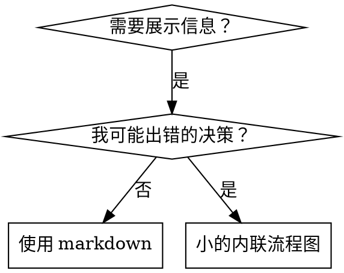

# 编写技能

## 概述

**编写技能就是将测试驱动开发应用于流程文档。**

**个人技能存放在代理特定目录中（Claude Code 为 `~/.claude/skills`，Codex 为 `~/.agents/skills/`）**

你编写测试用例（带子代理的压力场景），看它们失败（基线行为），编写技能（文档），看测试通过（代理合规），然后重构（堵住漏洞）。

**核心原则：** 如果你没有看到代理在没有技能的情况下失败，你无法知道技能是否教授了正确的东西。

**必读背景：** 在使用此技能之前，你**必须**理解 ultrapowers:red-green-cycle。该技能定义了基本的 RED-GREEN-REFACTOR 循环。此技能将 TDD 适配到文档。

**官方指南：** 有关 Anthropic 官方技能编写最佳实践，参见 ../references/anthropic-best-practices.md。该文档提供了补充此技能中 TDD 重点方法的额外模式和指南。

## 什么是技能？

**技能**是经过验证的技术、模式或工具的参考指南。技能帮助未来的 Claude 实例找到并应用有效的方法。

**技能是：** 可重用的技术、模式、工具、参考指南

**技能不是：** 关于你如何解决一次问题的叙述

## 技能的 TDD 映射

| TDD 概念 | 技能创建 |
|-------------|----------------|
| **测试用例** | 带子代理的压力场景 |
| **生产代码** | 技能文档（SKILL.md） |
| **测试失败（RED）** | 代理在没有技能的情况下违反规则（基线） |
| **测试通过（GREEN）** | 代理在技能存在时合规 |
| **重构** | 在保持合规的同时堵住漏洞 |
| **先写测试** | 在编写技能之前运行基线场景 |
| **看它失败** | 记录代理使用的确切借口 |
| **最小代码** | 编写解决这些特定违规的技能 |
| **看它通过** | 验证代理现在合规 |
| **重构循环** | 找到新借口 → 堵住 → 重新验证 |

整个技能创建过程遵循 RED-GREEN-REFACTOR。

## 何时创建技能

**创建当：**
- 技术对你来说不是直觉上明显的
- 你会在多个项目中再次参考这个
- 模式广泛适用（不是项目特定的）
- 其他人会受益

**不要为以下创建：**
- 一次性解决方案
- 其他地方有充分记录的标准实践
- 项目特定约定（放在 CLAUDE.md 中）
- 机械约束（如果可以用正则表达式/验证强制执行，自动化它 — 将文档留给判断调用）

## 技能类型

### 技术
具有可遵循步骤的具体方法（基于条件的等待、根本原因追踪）

### 模式
思考问题的方式（用标志扁平化、测试不变量）

### 参考
API 文档、语法指南、工具文档（office 文档）

## 目录结构

```
skills/
  skill-name/
    SKILL.md              # 主要参考（必需）
    supporting-file.*     # 仅在需要时
```

**扁平命名空间** — 所有技能在一个可搜索的命名空间中

**独立文件用于：**
1. **大量参考**（100+ 行）— API 文档、综合语法
2. **可重用工具** — 脚本、实用程序、模板

**保持内联：**
- 原则和概念
- 代码模式（< 50 行）
- 其他一切

## SKILL.md 结构

**前言（YAML）：**
- 两个必需字段：`name` 和 `description`（有关所有支持的字段，请参见 [agentskills.io/specification](https://agentskills.io/specification)）
- 总共最多 1024 个字符
- `name`：仅使用字母、数字和连字符（无括号、特殊字符）
- `description`：第三人称，仅描述**何时使用**（不是它做什么）
  - 以"Use when..."开头以聚焦触发条件
  - 包括具体的症状、情况和上下文
  - **绝不总结技能的流程或工作流**（为什么参见 CSO 部分）
  - 如果可能，保持在 500 个字符以下

```markdown
---
name: Skill-Name-With-Hyphens
description: [具体触发条件和症状]
---

# 技能名称

## 概述
这是什么？1-2 句话的核心原则。

## 何时使用
[如果决策不明显，小的内联流程图]

包含症状和使用案例的项目列表
何时不使用

## 核心模式（用于技术/模式）
前后代码比较

## 快速参考
常见操作的表格或项目符号

## 实现
简单模式的代码内联
大量参考或可重用工具的文件链接

## 常见错误
什么问题 + 修复

## 真实影响（可选）
具体结果
```

## Claude 搜索优化（CSO）

**对发现至关重要：** 未来的 Claude 需要**找到**你的技能

### 1. 丰富的描述字段

**目的：** Claude 读取描述以决定为给定任务加载哪些技能。让它回答："我现在应该阅读这个技能吗？"

**格式：** 以"Use when..."开头以聚焦触发条件

**关键：描述 = 何时使用，不是技能做什么**

描述应该只描述触发条件。不要在描述中总结技能的流程或工作流。

**为什么这很重要：** 测试揭示，当描述总结技能工作流时，Claude 可能遵循描述而不是阅读完整的技能内容。说"任务间代码审查"的描述导致 Claude 做一次审查，即使技能的流程图清楚地显示了两次审查（先规范符合性，然后代码质量）。

当描述改为仅"Use when 在当前会话中执行具有独立任务的实施计划"（无工作流总结）时，Claude 正确地阅读了流程图并遵循了两阶段审查流程。

**陷阱：** 总结工作流的描述创造了 Claude 将采用的快捷方式。技能主体成为 Claude 跳过的文档。

```yaml
# ❌ 差：总结工作流 — Claude 可能遵循这个而不是阅读技能
description: Use when executing plans - dispatches subagent per task with code review between tasks

# ❌ 差：太多流程细节
description: Use for TDD - write test first, watch it fail, write minimal code, refactor

# ✅ 好：只有触发条件，无工作流总结
description: Use when executing implementation plans with independent tasks in the current session

# ✅ 好：只有触发条件
description: Use when implementing any feature or bugfix, before writing implementation code
```

**内容：**
- 使用具体的触发器、症状和情况表明此技能适用
- 描述*问题*（竞态条件、不一致行为）而不是*特定于语言的症状*（setTimeout、sleep）
- 除非技能本身是特定于技术的，否则保持触发器与技术无关
- 如果技能是特定于技术的，在触发器中明确说明
- 用第三人称编写（注入到系统提示中）
- **绝不总结技能的流程或工作流**

```yaml
# ❌ 差：太抽象、模糊，不包括何时使用
description: For async testing

# ❌ 差：第一人称
description: I can help you with async tests when they're flaky

# ❌ 差：提到技术但技能不特定于它
description: Use when tests use setTimeout/sleep and are flaky

# ✅ 好：以"Use when"开头，描述问题，无工作流
description: Use when tests have race conditions, timing dependencies, or pass/fail inconsistently

# ✅ 好：具有明确触发器的技术特定技能
description: Use when using React Router and handling authentication redirects
```

### 2. 关键词覆盖

使用 Claude 会搜索的词：
- 错误消息："Hook timed out"、"ENOTEMPTY"、"竞态条件"
- 症状："flaky"、"hanging"、"zombie"、"pollution"
- 同义词："timeout/hang/freeze"、"cleanup/teardown/afterEach"
- 工具：实际命令、库名、文件类型

### 3. 描述性命名

**使用主动语态，动词优先：**
- ✅ `creating-skills` 而不是 `skill-creation`
- ✅ `condition-based-waiting` 而不是 `async-test-helpers`

### 4. 令牌效率（关键）

**问题：** 入门和频繁引用的技能加载到**每个**对话中。每个令牌都很重要。

**目标字数：**
- 入门工作流：每个 <150 字
- 频繁加载的技能：总共 <200 字
- 其他技能：<500 字（仍然要简洁）

**技术：**

**将细节移到工具帮助：**
```bash
# ❌ 差：在 SKILL.md 中记录所有标志
search-conversations supports --text, --both, --after DATE, --before DATE, --limit N

# ✅ 好：引用 --help
search-conversations supports multiple modes and filters. Run --help for details.
```

**使用交叉引用：**
```markdown
# ❌ 差：重复工作流细节
When searching, dispatch subagent with template...
[20 行重复指令]

# ✅ 好：引用其他技能
Always use subagents (50-100x context savings). REQUIRED: Use [other-skill-name] for workflow.
```

**压缩示例：**
```markdown
# ❌ 差：冗长示例（42 字）
你的合作伙伴："我们之前如何在 React Router 中处理身份验证错误？"
你：我将搜索过去对话中的 React Router 身份验证模式。
[派发带搜索查询的子代理："React Router authentication error handling 401"]

# ✅ 好：最小示例（20 字）
合作伙伴："我们如何在 React Router 中处理身份验证错误？"
你：搜索中...
[派发子代理 → 综合]
```

**消除冗余：**
- 不要在交叉引用的技能中重复内容
- 不要解释命令中明显的内容
- 不要包含相同模式的多个示例

**验证：**
```bash
wc -w skills/path/SKILL.md
# 入门工作流：目标每个 <150
# 其他频繁加载的：目标总共 <200
```

**按你做什么或核心洞察命名：**
- ✅ `condition-based-waiting` > `async-test-helpers`
- ✅ `using-skills` 不是 `skill-usage`
- ✅ `flatten-with-flags` > `data-structure-refactoring`
- ✅ `root-cause-tracing` > `debugging-techniques`

**动名词（-ing）适合流程：**
- `creating-skills`、`testing-skills`、`debugging-with-logs`
- 主动的，描述你正在采取的行动

### 4. 交叉引用其他技能

**在引用其他技能的文档时：**

仅使用技能名称，带有明确的需求标记：
- ✅ 好：`**必需子技能：** 使用 ultrapowers:red-green-cycle`
- ✅ 好：`**必读背景：** 你**必须**理解 ultrapowers:root-cause-analysis`
- ❌ 差：`See test-driven-development`（不清楚是否必需）
- ❌ 差：`@test-driven-development/SKILL.md`（强制加载，消耗上下文）

**为什么不用 @ 链接：** `@` 语法会立即强制加载文件，在你需要之前消耗 200k+ 上下文。

## 流程图使用



**仅在以下情况使用流程图：**
- 不明显的决策点
- 你可能过早停止的流程循环
- "何时使用 A vs B"决策

**永远不要对以下使用流程图：**
- 参考材料 → 表格、列表
- 代码示例 → Markdown 块
- 线性指令 → 编号列表
- 没有语义意义的标签（step1、helper2）

参见 ../references/../references/graphviz-conventions.dot 了解 graphviz 样式规则。

**为你的合作伙伴可视化：** 使用此目录中的 `../references/render-graphs.js` 将技能的流程图渲染为 SVG：
```bash
../references/../references/render-graphs.js ../some-skill           # 每个图表单独
../references/../references/render-graphs.js ../some-skill --combine # 所有图表在一个 SVG 中
```

## 代码示例

**一个优秀示例胜过许多平庸的示例**

选择最相关的语言：
- 测试技术 → TypeScript/JavaScript
- 系统调试 → Shell/Python
- 数据处理 → Python

**好的示例：**
- 完整且可运行
- 注释解释**为什么**
- 来自真实场景
- 清楚地展示模式
- 准备好适配（不是通用模板）

**不要：**
- 用 5+ 种语言实现
- 创建填空模板
- 编写虚构示例

你擅长移植 — 一个优秀示例就够了。

## 文件组织

### 自包含技能
```
defense-in-depth/
  SKILL.md    # 所有内容内联
```
当：所有内容适合，无需大量参考

### 带可重用工具的技能
```
condition-based-waiting/
  SKILL.md    # 概述 + 模式
  example.ts  # 可适配的工作辅助工具
```
当：工具是可重用代码，不仅仅是叙述

### 带大量参考的技能
```
pptx/
  SKILL.md       # 概述 + 工作流
  pptxgenjs.md   # 600 行 API 参考
  ooxml.md       # 500 行 XML 结构
  scripts/       # 可执行工具
```
当：参考材料太大无法内联

## 铁律（与 TDD 相同）

```
没有失败的测试，不允许创建技能
```

这适用于新技能**和**对现有技能的编辑。

编写技能前测试？删除它。重新开始。
没有测试就编辑技能？同样的违规。

**没有例外：**
- 不适用于"简单添加"
- 不适用于"只添加一个部分"
- 不适用于"文档更新"
- 不要将未测试的更改保留为"参考"
- 不要在运行测试时"适配"
- 删除意味着删除

**必读背景：** ultrapowers:red-green-cycle 技能解释了为什么这很重要。相同的原则适用于文档。

## 测试所有技能类型

不同的技能类型需要不同的测试方法：

### 纪律执行技能（规则/要求）

**示例：** TDD、verification-before-completion、designing-before-coding

**用以下测试：**
- 学术问题：他们理解规则吗？
- 压力场景：他们在压力下合规吗？
- 多种压力组合：时间 + 沉没成本 + 疲惫
- 识别借口并添加明确的反驳

**成功标准：** 代理在最大压力下遵循规则

### 技术技能（操作指南）

**示例：** condition-based-waiting、root-cause-tracing、defensive-programming

**用以下测试：**
- 应用场景：他们能正确应用技术吗？
- 变化场景：他们处理边缘情况吗？
- 缺失信息测试：指令有差距吗？

**成功标准：** 代理成功地将技术应用于新场景

### 模式技能（心智模型）

**示例：** reducing-complexity、information-hiding 概念

**用以下测试：**
- 识别场景：他们认识到模式何时适用吗？
- 应用场景：他们能使用心智模型吗？
- 反例：他们知道何时**不**适用吗？

**成功标准：** 代理正确识别何时/如何应用模式

### 参考技能（文档/API）

**示例：** API 文档、命令参考、库指南

**用以下测试：**
- 检索场景：他们能找到正确的信息吗？
- 应用场景：他们能正确使用找到的内容吗？
- 差距测试：是否涵盖了常见用例？

**成功标准：** 代理找到并正确应用参考信息

## 跳过测试的常见借口

| 借口 | 现实 |
|--------|---------|
| "技能显然很清楚" | 对你清楚 ≠ 对其他代理清楚。测试它。 |
| "这只是参考" | 参考可能有差距、不清楚的部分。测试检索。 |
| "测试太过分了" | 未测试的技能总是有问题。总是。15 分钟测试节省数小时。 |
| "如果有问题我会测试" | 问题 = 代理无法使用技能。在部署**之前**测试。 |
| "测试太乏味了" | 测试比调试生产中的坏技能更不乏味。 |
| "我确信它很好" | 过度自信保证有问题。还是测试。 |
| "学术审查就够了" | 阅读 ≠ 使用。测试应用场景。 |
| "没时间测试" | 部署未测试的技能浪费更多时间来修复它。 |

**所有这些都意味着：** 在部署前测试。没有例外。

## 防弹技能对抗借口

执行纪律的技能（如 TDD）需要抵抗借口。代理很聪明，在压力下会找到漏洞。

**心理学说明：** 理解**为什么**说服技术有效帮助你系统地应用它们。参见 ../references/persuasion-principles.md 了解研究基础（Cialdini, 2021; Meincke et al., 2025）关于权威、承诺、稀缺、社会认同和团结原则。

### 明确堵住每个漏洞

不要只陈述规则 — 禁止特定的变通方法：

<坏>
```markdown
代码写在测试前？删除它。
```
</坏>

<好>
```markdown
代码写在测试前？删除它。重新开始。

**没有例外：**
- 不要保留为"参考"
- 不要在编写测试时"适配"它
- 不要看它
- 删除意味着删除
```
</好>

### 解决"精神 vs 字母"争论

早期添加基本原则：

```markdown
**违反规则的字面意思就是违反规则的精神。**
```

这切断了整个"我遵循精神"的借口类别。

### 构建借口表

从基线测试中收集借口（见下面的测试部分）。代理提出的每个借口都进入表格：

```markdown
| 借口 | 现实 |
|--------|---------|
| "太简单了无法测试" | 简单代码也会坏。测试需要 30 秒。 |
| "我之后测试" | 立即通过的测试证明不了什么。 |
| "之后的测试达到相同目标" | 之后测试 = "这做什么？" 之前测试 = "应该做什么？" |
```

### 创建危险信号列表

让代理在找借口时容易自我检查：

```markdown
## 危险信号 — 停止并重新开始

- 代码在测试之前
- "我已经手动测试了"
- "之后的测试达到相同目的"
- "这是关于精神不是仪式"
- "这不同因为..."

**所有这些都意味着：** 删除代码。用 TDD 重新开始。
```

### 为违规症状更新 CSO

添加到描述：你**即将**违反规则的症状：

```yaml
description: 在实现任何功能或 bug 修复时使用，在编写实现代码之前
```

## 技能的 RED-GREEN-REFACTOR

遵循 TDD 循环：

### RED：编写失败测试（基线）

在**没有**技能的情况下用子代理运行压力场景。记录确切的行为：
- 他们做了什么选择？
- 他们使用了什么借口（逐字记录）？
- 什么压力触发了违规？

这是"看测试失败" — 你必须在编写技能之前看到代理自然做什么。

### GREEN：编写最小技能

编写解决这些特定借口的技能。不要为假设情况添加额外内容。

运行相同的场景，**有**技能。代理现在应该合规。

### REFACTOR：堵住漏洞

代理找到了新的借口？添加明确的反驳。重新测试直到防弹。

**测试方法：** 参见 ../references/../references/testing-skills-with-subagents.md 了解完整的测试方法：
- 如何编写压力场景
- 压力类型（时间、沉没成本、权威、疲惫）
- 系统性地堵住漏洞
- 元测试技术

## 反模式

### ❌ 叙事示例
"在 2025-10-03 会话中，我们发现空的 projectDir 导致..."
**为什么差：** 太具体，不可重用

### ❌ 多语言稀释
example-js.js、example-py.py、example-go.go
**为什么差：** 质量平庸，维护负担

### ❌ 流程图中的代码
```dot
step1 [label="import fs"];
step2 [label="read file"];
```
**为什么差：** 无法复制粘贴，难以阅读

### ❌ 通用标签
helper1、helper2、step3、pattern4
**为什么差：** 标签应该有语义意义

## 停止：在移动到下一个技能之前

**编写任何技能后，你必须停止并完成部署过程。**

**不要：**
- 批量创建多个技能而不测试每个
- 在当前技能被验证之前移动到下一个技能
- 因为"批量更高效"就跳过测试

**下面的部署清单对每个技能都是必需的。**

部署未测试的技能 = 部署未测试的代码。这是对质量标准的违反。

## 技能创建清单（TDD 适配）

**重要：** 为下面的每个清单项目使用 TodoWrite 创建待办事项。

**RED 阶段 — 编写失败测试：**
- [ ] 创建压力场景（纪律技能 3 种以上组合压力）
- [ ] 在没有技能的情况下运行场景 — 逐字记录基线行为
- [ ] 识别借口/失败中的模式

**GREEN 阶段 — 编写最小技能：**
- [ ] 名称仅使用字母、数字、连字符（无括号/特殊字符）
- [ ] YAML 前言包含必需的 `name` 和 `description` 字段（最多 1024 个字符；参见 [spec](https://agentskills.io/specification)）
- [ ] 描述以"Use when..."开头并包含具体触发器/症状
- [ ] 描述用第三人称编写
- [ ] 全文关键词用于搜索（错误、症状、工具）
- [ ] 包含核心原则的清晰概述
- [ ] 解决 RED 中识别的特定基线失败
- [ ] 代码内联或链接到单独文件
- [ ] 一个优秀示例（不是多语言）
- [ ] 运行有技能的场景 — 验证代理现在合规

**REFACTOR 阶段 — 堵住漏洞：**
- [ ] 从测试中识别新借口
- [ ] 添加明确的反驳（如果是纪律技能）
- [ ] 从所有测试迭代构建借口表
- [ ] 创建危险信号列表
- [ ] 重新测试直到防弹

**质量检查：**
- [ ] 仅在不明显时使用小流程图
- [ ] 快速参考表格
- [ ] 常见错误部分
- [ ] 没有叙事讲故事
- [ ] 支持文件仅用于工具或大量参考

**部署：**
- [ ] 将技能提交到 git 并推送到你的 fork（如果已配置）
- [ ] 考虑通过 PR 贡献回来（如果广泛有用）

## 发现工作流

未来 Claude 如何找到你的技能：

1. **遇到问题**（"测试不稳定"）
3. **找到技能**（描述匹配）
4. **扫描概述**（这相关吗？）
5. **阅读模式**（快速参考表格）
6. **加载示例**（仅在实现时）

**为此流程优化** — 将可搜索的术语放在前面并经常放。

## 技能合规与维护

### 合规测量（skill-comply）

磁盘上有技能不意味着代理会遵循它。使用这些技术来验证：

**三级提示严格度测试：**
1. **支持性** — 提示明确引用技能
2. **中性** — 提示以任务为中心，技能必须自行触发
3. **竞争性** — 提示制造跳过技能的压力

在所有三个级别运行相同的场景。如果合规性在第 2-3 级下降，技能需要更强的触发器或描述需要更丰富的关键词。

**自动化规范生成：** 从任何 SKILL.md 中提取预期行为序列。运行代理，捕获工具调用轨迹，将调用分类到规范步骤（基于 LLM，而非正则表达式）。报告合规率及完整时间线。

### 技能库存审计（skill-stocktake）

定期审计技能库以防止膨胀：

**快速扫描：** 仅重新评估自上次运行以来更改的技能（将 mtime 与 results.json 比较）。

**全面盘点：** 盲目评估所有技能，不考虑来源。

**判定类别：**

| 判定 | 含义 |
|------|------|
| 保留 | 有用且最新 |
| 改进 | 值得保留，需要特定更改 |
| 更新 | 技术引用已过时（使用 WebSearch 验证） |
| 退役 | 质量低、陈旧或成本不对称 |
| 合并至 [X] | 与另一技能有大量重叠；命名合并目标 |

**原因质量要求：**
- **退役：** 说明 (1) 发现的具体缺陷，(2) 什么替代方案覆盖了相同需求
- **合并：** 命名目标并描述要集成的内容
- **改进：** 描述具体更改（哪个部分、什么操作、目标大小）
- **保留**（快速扫描）：重述核心证据，不要只写"未更改"

**每个技能的检查清单：**
- [ ] 已检查与其他技能的内容重叠情况
- [ ] 已检查与 MEMORY.md / CLAUDE.md 的重叠情况
- [ ] 已验证技术引用的时效性（如果存在工具名称 / CLI 参数 / API，请使用 WebSearch 进行验证）
- [ ] 已考虑使用频率

## 底线

**创建技能就是文档的 TDD。**

相同的铁律：没有失败的测试，不允许创建技能。
相同的循环：RED（基线）→ GREEN（编写技能）→ REFACTOR（堵住漏洞）。
相同的好处：更高质量、更少惊喜、防弹结果。

如果你对代码遵循 TDD，就对技能遵循它。这是应用于文档的相同纪律。
