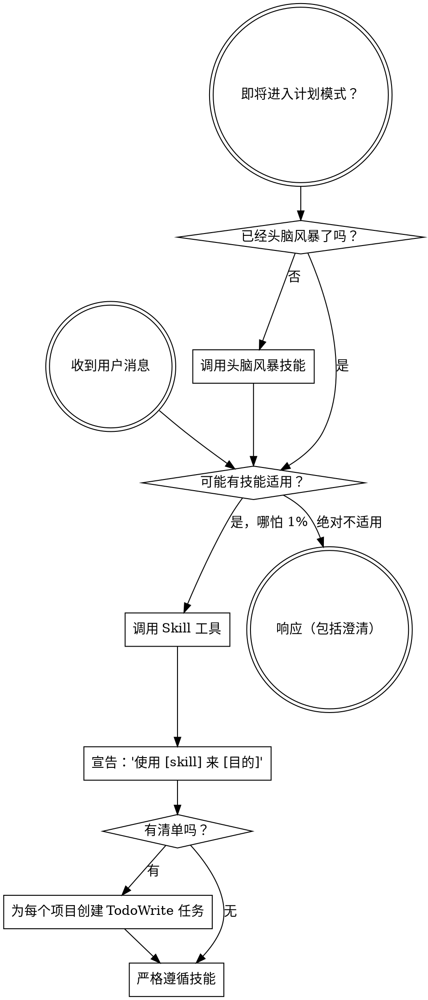

<SUBAGENT-STOP>
如果你被派为子代理执行特定任务，跳过此技能。
</SUBAGENT-STOP>

<EXTREMELY-IMPORTANT>
如果你认为有哪怕 1% 的概率某个技能可能适用，你绝对必须调用该技能。

如果技能适用于你的任务，你没有选择。你必须使用它。

这没有商量余地。这不是可选的。你不能为此找借口。
</EXTREMELY-IMPORTANT>

## 指令优先级

Superpowers 技能覆盖默认的系统提示行为，但**用户指令始终优先**：

1. **用户的明确指令**（CLAUDE.md、GEMINI.md、AGENTS.md、直接请求）— 最高优先级
2. **Superpowers 技能** — 在冲突时覆盖默认系统行为
3. **默认系统提示** — 最低优先级

如果 CLAUDE.md、GEMINI.md 或 AGENTS.md 说"不要使用 TDD"而技能说"始终使用 TDD"，遵循用户的指令。用户掌控一切。

## 如何访问技能

**在 Claude Code 中：** 使用 `Skill` 工具。当你调用技能时，其内容被加载并呈现给你 — 直接遵循它。永远不要对技能文件使用 Read 工具。

**在 Copilot CLI 中：** 使用 `skill` 工具。技能从已安装的插件中自动发现。`skill` 工具的工作方式与 Claude Code 的 `Skill` 工具相同。

**在 Gemini CLI 中：** 技能通过 `activate_skill` 工具激活。Gemini 在会话开始时加载技能元数据，按需激活完整内容。

**在其他环境中：** 查看你的平台文档了解如何加载技能。

## 平台适配

技能使用 Claude Code 工具名称。非 CC 平台：参见 `../references/copilot-tools.md`（Copilot CLI）、`../references/codex-tools.md`（Codex）了解工具等效物。Gemini CLI 用户通过 GEMINI.md 自动加载工具映射。

# 使用技能

## 规则

**在回答或行动之前调用相关或请求的技能。** 即使只有 1% 的概率技能可能适用，你也应该调用技能来检查。如果被调用的技能对情况来说不合适，你不需要使用它。



## 危险信号

这些想法意味着停止 — 你在找借口：

| 想法 | 现实 |
|------|------|
| "这只是个简单问题" | 问题就是任务。检查技能。 |
| "我需要更多上下文" | 技能检查在澄清问题**之前**。 |
| "让我先探索代码库" | 技能告诉你**如何**探索。先检查。 |
| "我可以快速检查 git/文件" | 文件缺少对话上下文。检查技能。 |
| "让我先收集信息" | 技能告诉你**如何**收集信息。 |
| "这不需要正式技能" | 如果技能存在，就使用它。 |
| "我记得这个技能" | 技能会演进。阅读当前版本。 |
| "这不算任务" | 行动 = 任务。检查技能。 |
| "这个技能太过分了" | 简单的事情变复杂。使用它。 |
| "我就先做这一件事" | 在**做任何事之前**检查。 |
| "这感觉很高效" | 无纪律的行动浪费时间。技能防止这个。 |
| "我知道那是什么意思" | 知道概念 ≠ 使用技能。调用它。 |

## 技能优先级

当多个技能可能适用时，使用以下顺序：

1. **流程技能优先**（头脑风暴、调试）— 这些决定**如何**处理任务
2. **实现技能其次**（前端设计、mcp-builder）— 这些指导执行

"构建 X" → 先头脑风暴，然后实现技能。
"修复这个 bug" → 先调试，然后领域特定技能。

## 技能类型

**刚性**（TDD、调试）：严格遵循。不要消解纪律。

**灵活**（模式）：根据上下文调整原则。

技能本身会告诉你是哪种。

## 上下文预算意识

技能消耗上下文窗口令牌。每个令牌都很重要。

**令牌估算规则：**
- 散文：单词数 × 1.3
- 代码密集型文件：字符数 ÷ 4

**关键约束：**
- 代理描述即使从未被调用也会在每个会话中加载 — 保持描述在 30 词以内
- 每个 MCP 工具模式消耗约 500 令牌 — 一个 30 工具的服务器的成本超过所有技能的总和
- 会话开始时加载的技能：每个保持在 200 词以内
- CLAUDE.md 链总数：保持在 300 行以内

**在添加技能或 MCP 服务器之前：**
1. 估算令牌成本（单词数 × 1.3）
2. 问："这值得上下文成本吗？"
3. 优先按需加载而非始终加载

**超出预算的迹象：**
- 响应感觉变慢或连贯性降低
- 最近添加了许多技能/MCP 服务器
- 代理似乎"忘记"了早期的指令

## 安全防护

在生产系统上工作或以自主代理模式运行时，启用安全防护以防止破坏性操作。

### 三种保护模式

**模式 1 — 谨慎模式：** 在执行破坏性命令前拦截并发出警告：
```
监控的模式：
- rm -rf（特别是 /、~ 或项目根目录）
- git push --force / git reset --hard
- git checkout .（丢弃所有更改）
- DROP TABLE / DROP DATABASE
- docker system prune
- kubectl delete
- chmod 777 / sudo rm
- npm publish（意外发布）
- 任何带有 --no-verify 的命令
```
检测到时：显示命令功能、请求确认、建议更安全的替代方案。

**模式 2 — 冻结模式：** 将文件编辑锁定到特定目录树：
```
/safety-guard freeze src/components/
```
任何在允许路径之外的写入/编辑操作都会被阻止并附带说明。

**模式 3 — 守护模式（谨慎+冻结组合）：**
自主代理的最高保护。代理可读取任何内容，但仅能在允许的路径中写入，所有位置的破坏性命令均被阻止。

### 解锁
```
/safety-guard off
```

### 实现方式
通过 PreToolUse 钩子拦截 Bash、Write、Edit 和 MultiEdit 工具调用。所有被阻止的操作记录至 `~/.claude/safety-guard.log`。

**相关 ECC 技能：** `safety-guard` — 与 `gateguard` 互补（后者通过事实调查门控编辑，而非命令阻止）。

## 用户指令

指令说**什么**，而不是**如何**。"添加 X"或"修复 Y"不意味着跳过工作流。
